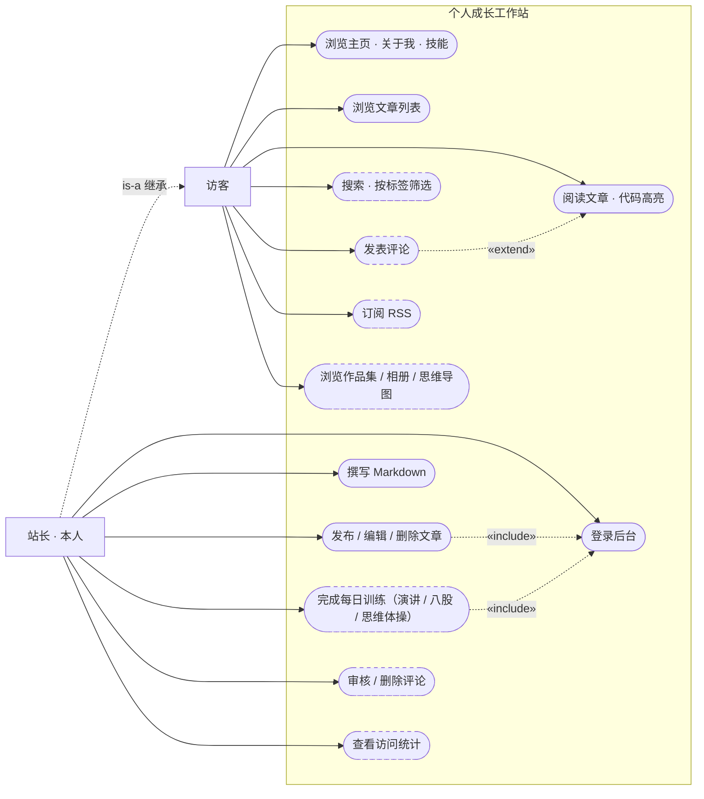
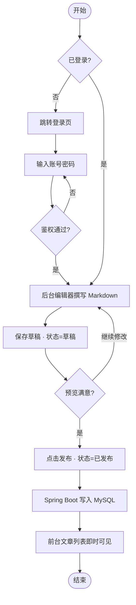
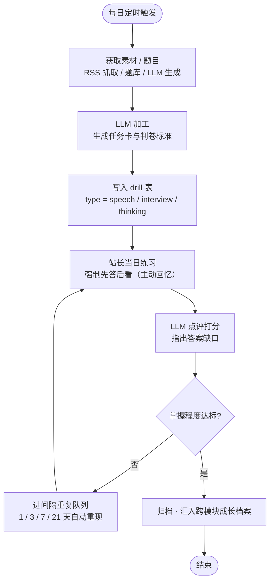
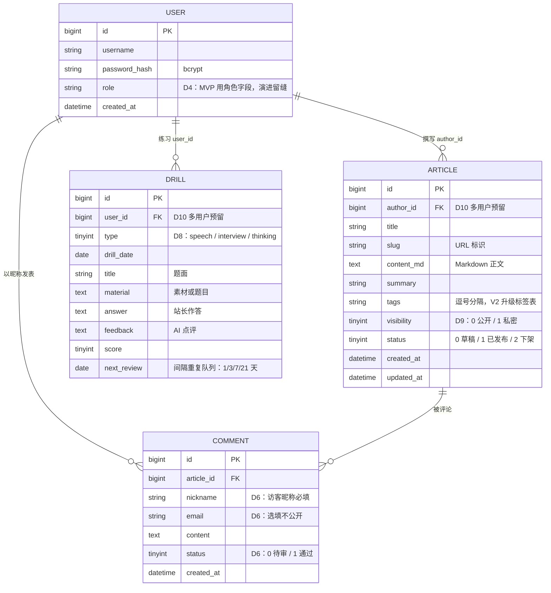

# 个人博客系统 · 需求与可行性分析

> v1.1 · 2026-08-27 · 轻量"一页纸"分析，随项目演进迭代，重大变更需改版本号
> v1.1 变更：项目定位升级——从"个人技术博客"到"个人成长工作站"（决策 D9）

## 1. 项目定位

**一句话定位**：一个人的成长工作站——**建站的过程练技术，用站的过程练自己**。

三层价值（权重从高到低）：

1. **自我成长工具**（核心）——学习笔记、心得、思维导图、各类训练（演讲/八股/思维）、创作（剪辑/摄影）与生活（旅行）的集成承载地；首要用户是站长本人
2. **全栈能力训练场**——每个功能对应一项技术，网站即课程作业
3. **对外展示窗口**（暂不启用）——先零压力打磨自己与网站，不宣传；未来想公开时，它随时是一张名片

**成功标准**：

- 硬标准：阶段 7 完成——全栈版上线，能在自己网站后台登录发文，访客能读到
- 学习标准：能独立讲清"一次点击从浏览器 → Nginx → Spring Boot → MySQL → 返回"的全过程

## 2. 可行性结论

| 维度 | 结论 |
|---|---|
| 技术 | ✅ Vue 3 / Spring Boot 3 / MySQL / Nginx 全为成熟主流栈，资料充足 |
| 时间 | ✅ 里程碑制，无截止日；已验证节奏（3 天完成阶段 0+1） |
| 经济 | ✅ 当前 0 元；域名约 70 元/年；阶段 7 起服务器 50~100 元/月 |

主要风险在"人"不在技术：弃坑（对策：每阶段必须上线）、范围蔓延（对策：第 4 节"不做"清单）、内容荒（对策：决策 D1）、AI 依赖（对策：我写你读、关键处亲手改）。

## 3. 用户与场景

- **访客**（朋友 / 同行 / 潜在雇主）：10 秒内明白站主是谁；顺畅读文章（多为技术笔记，含代码）；手机体验不差
- **管理员**（站主本人）：登录后台 → 写 Markdown → 发布 / 编辑 / 删除，全程不碰数据库

### 3.1 用例图（v1.1 更新）

> 图例：**虚线边框 = V2/V2+（后置），实线边框 = MVP**。关系线：`is-a` 站长继承访客全部用例；`«include»` 发布文章与每日训练必然包含登录（训练数据是私密的）；`«extend»` 评论是阅读的可选扩展。
> v1.1 变更：系统边界更名为"个人成长工作站"；新增 UC13 每日训练（D7/D8）、UC12 作品集/相册/思维导图（§8 内容形态）；可见性控制（D9）不单独立用例——它作用于浏览类用例（私密内容仅登录后可见）。

## 4. 功能需求

### MVP（对应阶段 2~6）

- Vue 3 版主页（关于我 / 技能 / 联系）
- 文章列表页 + 文章详情页（Markdown 渲染 + **代码高亮**——双线笔记必然贴代码）
- 管理后台：登录、发布 / 编辑 / 删除文章
- MySQL 持久化 + 前后端分离架构

### V2（阶段 8+，一次只加一个）

- 评论系统（含防垃圾策略）
- 文章标签 / 分类、访问统计、站内搜索、RSS
- 图床 / 图片管理方案

### 明确不做（防范围蔓延清单）

- 社交功能（点赞 / 关注）
- 富文本编辑器（Markdown 足够）
- 小程序 / App、广告变现、深度 SEO 优化
- ~~多用户注册体系~~ → **已升级为 D10 分阶段演进**（L0 自用 → L1 邀请制 → L2 开放注册），不再是"不做"，是"后置且按验证推进"

## 5. 非功能需求

- 响应式：手机可用（已有底子）
- HTTPS（阶段 7）
- 安全基线：密码 bcrypt 哈希、接口鉴权、防 SQL 注入（阶段 6）
- 性能：首屏加载 ≤ 2s（简单目标）
- 密钥管理：数据库密码、LLM API key 等一律走 .env / 环境变量，**永不提交进 git**（v1.1 补）
- 数据备份：MySQL 定时备份（mysqldump 脚本 + 异地/网盘存储），阶段 7 随部署落地（v1.1 补）
- 可观测基础：关键接口日志 + 健康检查端点（阶段 7，v1.1 补）

## 6. 关键决策记录

| # | 决策 | 结论 | 理由与影响 |
|---|---|---|---|
| D1 | 博客内容方向 | **嵌入式 + 全栈双线笔记** | 内容供给可持续，学习即素材；影响：代码高亮进 MVP，图床后置 V2 |
| D2 | 评论系统 | **不进 MVP，后置 V2** | 先跑通"发文→阅读"闭环，遵守"同时只学一个新技术" |
| D3 | 文章存储与发布 | **数据库 + 管理后台**（Spring Boot + MySQL + 前后端分离） | 学习价值最大化：真实练到 CRUD、数据库、登录鉴权 |
| D4 | 权限模型 | **MVP 不做 RBAC**：user 表 role 字段 + 统一鉴权拦截收口 | 2 角色 + 权限不变的场景上 RBAC 属过度设计；收口一处留好演进缝，未来按"role 枚举 → 角色表 → 权限表"渐进迁移 |
| D5 | 自研 vs 脚手架二开 | **MVP 手搓；若依（RuoYi）后置为参考答案与第二项目备选** | 项目第一目标是能力提升，若依会代劳掉阶段 3~6 全部核心学习点（类比：先用寄存器点灯，再用 HAL 库）；手搓后研读若依的工程化封装才是增益 |
| D6 | 评论系统形态 | **访客评论（昵称必填、邮箱选填、可审核可删）** | 低门槛不断流量；防滥用组合：限流 + 审核 + 敏感词/纯链接拦截，V2+ 可升级 AI 审核 |
| D7 | 演讲锻炼台（每日素材 agent） | **纳入 V2 AI 阶梯第 1 项，排在阶段 7 后** | 依赖阶段 3~5 地基（定时任务/数据库/接口）+ 常驻宿主（阶段 7 服务器；GitHub Actions cron 仅作过渡 hack）。分级：L1 RSS 抓取入库 → L2 LLM 生成演讲任务卡 → L3 练习反馈闭环。抓取只用 RSS，不爬网页 |
| D8 | 训练类功能统一引擎 | **演讲 / 八股 / 思维三模块合并为"每日训练营"，共享"出题→练习→AI 点评"管线** | 三个需求同构，收敛为一个引擎：一张 drill 表 + type 枚举 + 一条定时管线。八股特训强制"先答后看"（主动回忆），错题进间隔重复队列；思维体操含金字塔复述 / 信息排序 / 一句话总结 / So-what 追问四题型 |
| D9 | 项目定位升级（v1.1） | **从"个人技术博客"升级为"个人成长工作站"，文章只是内容形态之一** | 站长真实意图：集成笔记/导图/训练/创作/生活，先私密打磨不宣传。对架构零冲击：内容形态走 §8 成长轴逐个扩展（思维导图图片起步、markmap 进阶；剪辑/摄影走作品集+图床，图床优先级上调）；"可公开可不公开"由可见性控制实现（内容打私密标记、登录后可见，依赖阶段 6 登录能力），排入 V2。阶段 3~7 主线路线完全不变 |
| D10 | 多用户开放（他人也可使用训练体系） | **后置 V3，四档渐进：L0 自用 → L1 邀请制 → L2 开放注册 → L3 产品化** | 前提：站长本人先用出效果（自己是用户 #1）；L1 邀请制零成本验证需求（user 表加记录发账号，复用阶段 6 登录系统）；多用户化的真实成本是分水岭：数据表加 user_id、数据隔离、LLM API 按用户增长、内容合规与经营性备案——届时启用 D4 的角色表演进。阶段 4 建表时预留 author_id / user_id 字段（一行字段的成本） |

## 7. 核心流程图：发布文章（MVP 最关键路径）

> 这张图就是阶段 3~6 的施工总览：登录鉴权（阶段 6）、后台编辑（阶段 6）、数据库写入（阶段 4）、前台展示（阶段 2/5）——每学完一阶段，回来把对应节点标绿。

## 8. 可成长性设计

网站的成长轴与对应策略：

| 成长轴 | 例子 | 策略 |
|---|---|---|
| 内容领域 | 新增 AI / 读书笔记等板块 | 天然支持：新增分类/标签即可，架构零改动（D3 红利） |
| 内容形态 | 作品集页（剪辑/摄影）、相册（旅行）、思维导图（图片起步，markmap 进阶）、小工具页 | 需要时加"页面类型"，做一次小迁移，不预建；图床因创作需求优先级上调 |
| 可见性控制 | 公开 / 私密内容分级 | 依赖阶段 6 登录能力，V2 实现"私密内容仅登录可见"，服务"先打磨不宣传"策略 |
| 功能 | 评论、AI 问答、统计 | 走 V2 阶梯，一次加一个 |

> 原则：可成长性来自**分层干净 + 数据模型核心正确 + 鉴权等关键路径收口在一处**，不来自预支想象中的功能（YAGNI）。新需求出现当天，修订本文档并升版本号。

## 9. AI 功能阶梯（V2+，一次只做一个）

| 序 | 功能 | 说明 |
|---|---|---|
| 1 | **每日训练营**（D7/D8） | 统一引擎，三种训练：**演讲台**（每日素材 + 演讲任务卡）、**八股特训**（AI 出题 + 判卷 + 错题间隔重复）、**思维体操**（金字塔复述 / 信息排序 / 一句话总结 / So-what 追问） |
| 2 | AI 写作助手 | 后台写文章时一键润色、补代码示例 |
| 3 | 智能摘要与自动标签 | 发文时自动生成摘要和分类标签 |
| 4 | 语义搜索 | 向量嵌入替代关键词搜索 |
| 5 | RAG 站内问答 | 访客直接问，AI 基于全站文章回答 |

### 9.1 训练营引擎流程图（三模块共享同一管线，D8）

> 这条管线对三种训练完全一致，差异只存在于"获取"和"LLM 加工"两站的 prompt 模板——这就是 D8 说"同一引擎"的图形化证明。

## 10. ER 图（数据模型 v0 草案，阶段 4 建表前定稿）

> 阅读方式：每个字段的注释都标注了来源决策（D 编号）——**这张表是十条决策的沉淀**。v0 草案服务于阶段 3 的 API 字段设计；阶段 4 建表前结合实现中发现的细节定稿（比如索引、字段长度、是否拆标签表）。
