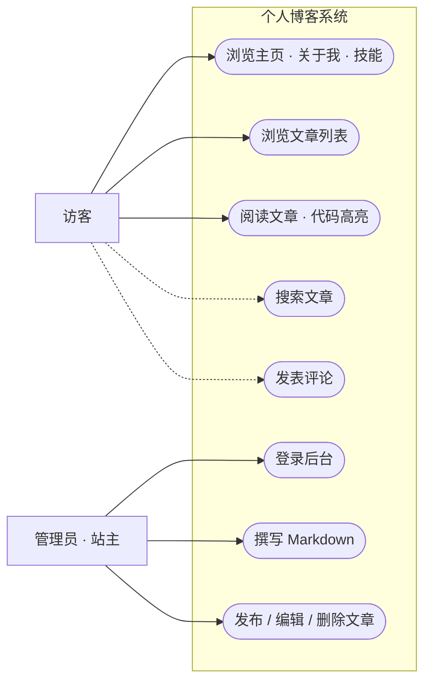

# 个人博客系统 · 需求与可行性分析

> v1.0 · 2026-08-24 · 轻量"一页纸"分析，随项目演进迭代，重大变更需改版本号

## 1. 项目定位

**一句话定位**：一个嵌入式工程师亲手搭建的全栈个人博客——网站本身就是这种能力的证明。

一物三用（权重从高到低）：

1. **全栈能力训练场**（核心）——每个功能对应一项技术，网站即课程作业
2. **个人技术博客**——沉淀嵌入式 + Web 双线学习笔记
3. **个人名片 / 能力证明**——给朋友、同行、潜在机会的一个链接

**成功标准**：

- 硬标准：阶段 7 完成——全栈版上线，能在自己网站后台登录发文，访客能读到
- 学习标准：能独立讲清"一次点击从浏览器 → Nginx → Spring Boot → MySQL → 返回"的全过程

## 2. 可行性结论

| 维度 | 结论 |
|---|---|
| 技术 | ✅ Vue 3 / Spring Boot 3 / MySQL / Nginx 全为成熟主流栈，资料充足 |
| 时间 | ✅ 里程碑制，无截止日；已验证节奏（3 天完成阶段 0+1） |
| 经济 | ✅ 当前 0 元；域名约 70 元/年；阶段 7 起服务器 50~100 元/月 |

主要风险在"人"不在技术：弃坑（对策：每阶段必须上线）、范围蔓延（对策：第 4 节"不做"清单）、内容荒（对策：决策 D1）、AI 依赖（对策：我写你读、关键处亲手改）。

## 3. 用户与场景

- **访客**（朋友 / 同行 / 潜在雇主）：10 秒内明白站主是谁；顺畅读文章（多为技术笔记，含代码）；手机体验不差
- **管理员**（站主本人）：登录后台 → 写 Markdown → 发布 / 编辑 / 删除，全程不碰数据库

### 3.1 用例图

> 图例：**实线 = MVP 范围，虚线 = V2（后置）**。管理员同时具备访客的全部用例（管理员也是读者），图中省略不画。

## 4. 功能需求

### MVP（对应阶段 2~6）

- Vue 3 版主页（关于我 / 技能 / 联系）
- 文章列表页 + 文章详情页（Markdown 渲染 + **代码高亮**——双线笔记必然贴代码）
- 管理后台：登录、发布 / 编辑 / 删除文章
- MySQL 持久化 + 前后端分离架构

### V2（阶段 8+，一次只加一个）

- 评论系统（含防垃圾策略）
- 文章标签 / 分类、访问统计、站内搜索、RSS
- 图床 / 图片管理方案

### 明确不做（防范围蔓延清单）

- 多用户注册体系、社交功能（点赞 / 关注）
- 富文本编辑器（Markdown 足够）
- 小程序 / App、广告变现、深度 SEO 优化

## 5. 非功能需求

- 响应式：手机可用（已有底子）
- HTTPS（阶段 7）
- 安全基线：密码 bcrypt 哈希、接口鉴权、防 SQL 注入（阶段 6）
- 性能：首屏加载 ≤ 2s（简单目标）

## 6. 关键决策记录

| # | 决策 | 结论 | 理由与影响 |
|---|---|---|---|
| D1 | 博客内容方向 | **嵌入式 + 全栈双线笔记** | 内容供给可持续，学习即素材；影响：代码高亮进 MVP，图床后置 V2 |
| D2 | 评论系统 | **不进 MVP，后置 V2** | 先跑通"发文→阅读"闭环，遵守"同时只学一个新技术" |
| D3 | 文章存储与发布 | **数据库 + 管理后台**（Spring Boot + MySQL + 前后端分离） | 学习价值最大化：真实练到 CRUD、数据库、登录鉴权 |
| D4 | 权限模型 | **MVP 不做 RBAC**：user 表 role 字段 + 统一鉴权拦截收口 | 2 角色 + 权限不变的场景上 RBAC 属过度设计；收口一处留好演进缝，未来按"role 枚举 → 角色表 → 权限表"渐进迁移 |
| D5 | 自研 vs 脚手架二开 | **MVP 手搓；若依（RuoYi）后置为参考答案与第二项目备选** | 项目第一目标是能力提升，若依会代劳掉阶段 3~6 全部核心学习点（类比：先用寄存器点灯，再用 HAL 库）；手搓后研读若依的工程化封装才是增益 |

## 8. 可成长性设计

网站的成长轴与对应策略：

| 成长轴 | 例子 | 策略 |
|---|---|---|
| 内容领域 | 新增 AI / 读书笔记等板块 | 天然支持：新增分类/标签即可，架构零改动（D3 红利） |
| 内容形态 | 作品集页、相册、小工具页 | 需要时加"页面类型"，做一次小迁移，不预建 |
| 功能 | 评论、AI 问答、统计 | 走 V2 阶梯，一次加一个 |

> 原则：可成长性来自**分层干净 + 数据模型核心正确 + 鉴权等关键路径收口在一处**，不来自预支想象中的功能（YAGNI）。新需求出现当天，修订本文档并升版本号。

## 7. 核心流程图：发布文章（MVP 最关键路径）

> 这张图就是阶段 3~6 的施工总览：登录鉴权（阶段 6）、后台编辑（阶段 6）、数据库写入（阶段 4）、前台展示（阶段 2/5）——每学完一阶段，回来把对应节点标绿。
